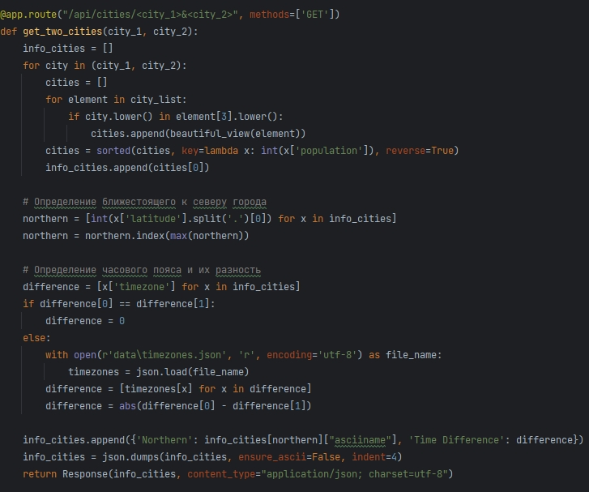

# 1. Метод **get_info_by_id** #

Метод принимает аргумент geonameid, эквивалентный geonameid города в файле RU.txt. 
Далее проходит по списку city_list и находит соответствие между geonameid города и geonameid из аргумента. 
После сериализирует данные в json-формат и возвращает информацию о городе.

# Пример запроса: GET /api/cities/1498633 
Результат: 

# 2. Метод **get_info_for_page** #

Метод принимает аргументы num_page и count_cities, где num_page - текущая страница, count_cities - кол-во городов,
отображаемых на странице. Далее создается список page, в котором будут храниться страницы, которые нужно отобразить.
Проходим по списку city_list, где индексом является индекс города в списке city_list, который нужно отобразить на текущей странице.
После сериализирует данные в json-формат и возвращает список информации о городах.

# Пример запроса: GET /api/cities/page=1&count=2
Результат: 

# 3. Метод **get_two_cities** #

Метод принимает аргументы city_1 и city_2, где каждый аргумент является названием города на русском языке.
Далее создается список info_cities для хранения городов с соответсвующим названием. 
Создаем внешний цикл с переменной city, которой будем передавать название города из аргумента. 
Затем создаем список cities для записи всех городов найденных в списке city_list, соответствующим переменной city с помощью внутреннего цикла.
После цикла список cities сортируем по кол-ву населения от большего к меньшему, добавляя первый город в список info_cities, 
тем самым избавляясь от городов с меньшим населением. Создаем переменную northern для вычисления наиболее ближестоящего города к северу.
Создаем генератор с данными, где числа являются градусами относительно широты, находим максимальное число и вычисляем его индекс, 
чтобы определить, какой город находится севернее. Далее создаем переменную difference для вычисления разности часовых поясов.
Находим часовой пояс из переменой timezones и находим разность. Добавляем наши значения в список info_cities и сериализируем данные в json-формат.
Вовзращаем полученный список

# Пример запроса: GET /api/cities/мишкино&красная%20горка 
Результат: 

# 4. Метод **get_city_by_some_letters** #

Метод принимает аргумент letters, который является частью name - названия города из файла RU.txt.
Создаем словарь cities для записи всех продолжений, переменную letters возвоздим в нижний регистр, переменную length - длина введенного слова.
Запускаем цикл по списку city_list, чтобы найти соответствие. Добавляем наши значения в словарь cities, где ключи являются порядковым номером,
а значения - полное название города. Сериализируем данные в json-формат и возвращаем словарь.

# Пример запроса: GET /api/cities/mishk
Результат: 

